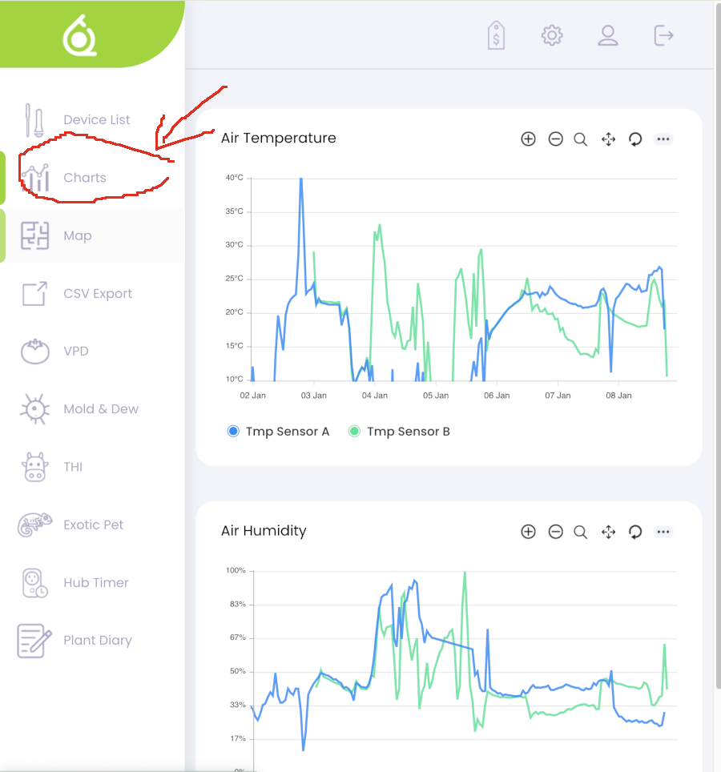
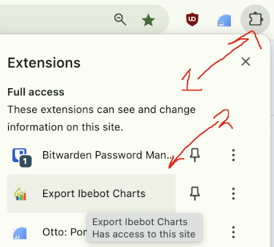
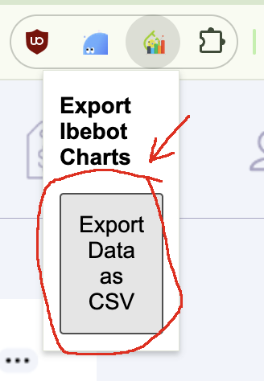
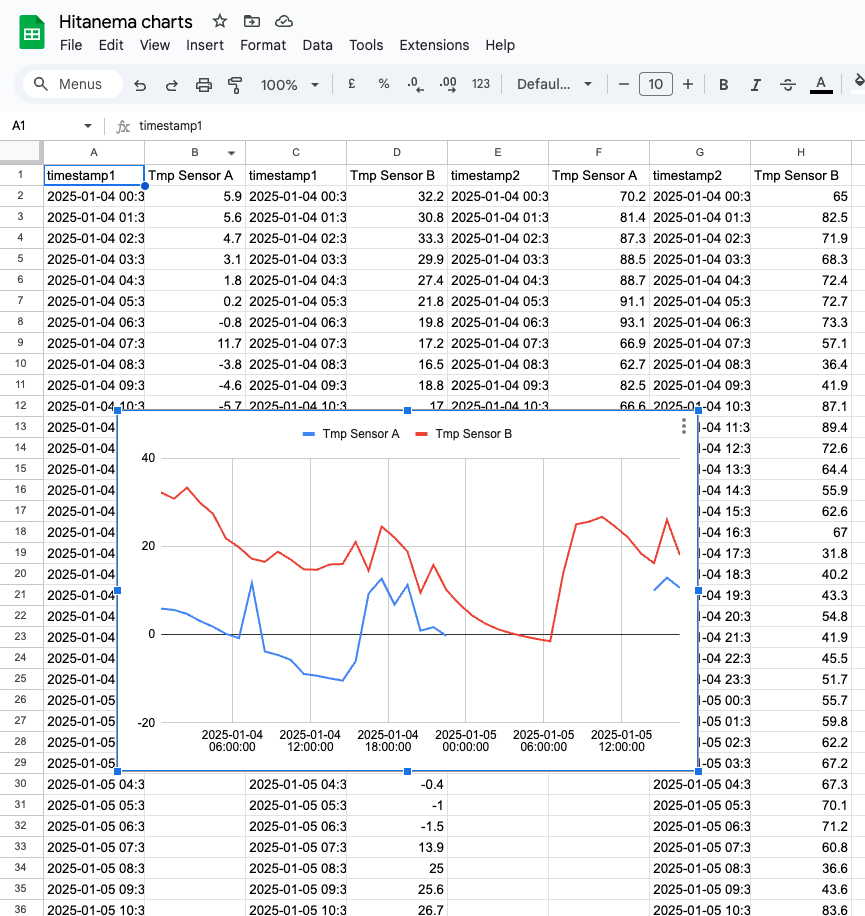

# Chrome Extension to export IBEBOT Charts Data as CSV 

This Chrome extension allows users to export data from the charts section in the connect.ibebot.com website. It exports the data to CSV files for easy analysis in Excel or other tools. It automatically detects the charts and generates a downloadable CSV file with timestamped data and appropriate labels.

---

## Features

- Detects ApexCharts instances on the website.
- Extracts X-axis (timestamps) and Y-axis (series data) values.
- Adds units like `°C` and `g/m³` to relevant labels.
- Outputs a well-structured CSV file ready for Excel or other tools.
- Optimized for `ibebot.com`.

---

## Installation

1. Download the repo into a folder
2. Open "chrome://extension" in Chrome
3. Toggle the "Developer Mode" on, in the top right corner of the browser
4. Click "Load Unpacked" and choose the repo folder

## Usage: Step by step guide

1. Log into https://connect.ibebot.com
2. Go to Charts section
3. 
4. Open the Extensions Dropdown, like so 
5. 
6. Click the button to download the CSV data
7. 
8. You should now be able to open the data in Excel or wherever you want.
9. 

